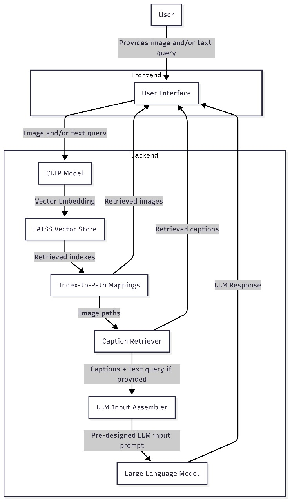
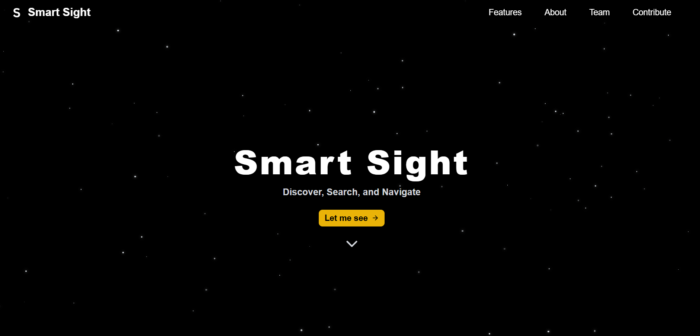
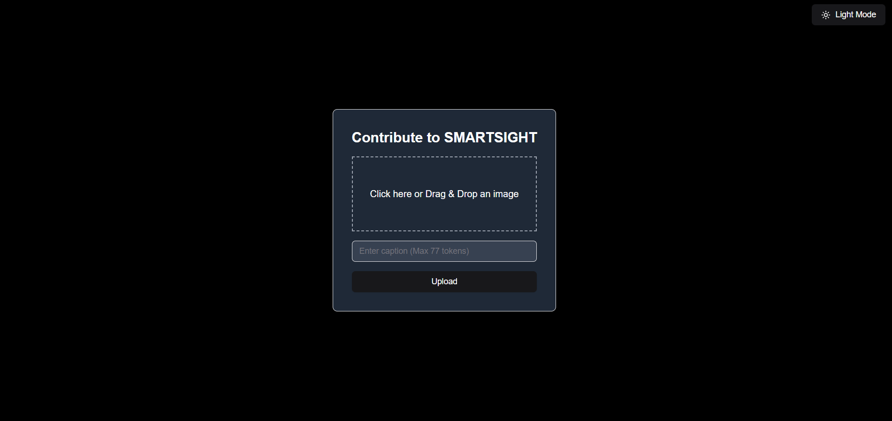

<table>
  <tr>
    <td></td>
    <td><h1>Smart Sight <span style="font-size: 1.5rem; color: grey;">— Discover, Search, and Navigate</span></h1></td>
  </tr>
</table>


## 📌 Overview
SmartSight is a **state-of-the-art multi-modal query system** that integrates **computer vision, natural language processing, and similarity search** to retrieve visually and semantically similar images from a database.

### ✨ Key Features
✔️ **Multi-modal Search**: Query using images, text, or both.  
✔️ **Efficient Similarity Search**: Uses **FAISS** for fast retrieval over large datasets.  
✔️ **CLIP-based Embeddings**: Ensures accurate **semantic matching**.  
✔️ **Google Gemini AI Integration**: Provides **context-aware responses**.  
✔️ **User Contribution System**: Users can **add images and captions** for future indexing. 


## 🧱 System Architecture




## **🔧 Technology Stack**


| Component      | Technologies |
|---------------|-------------|
| **Frontend**  |         |
| **Backend**   |   |
| **Database**  |  |
| **AI Models** |   |


## 🚀 Getting Started

### Prerequisites
- **Python 3.8+**
- **Node.js 16+**
- **pip** (for Python package management)
- **Git** for version control

## 📸 Interface Overview

###  Home Page


### Search Page


### Contribute Page

   > The **Contribute page** allows users to add new images and captions, which are later verified and 
   appended to the dataset.

## ⚙️ Installation & Setup

### 🔹 1. Clone the Repository

```sh
git clone https://github.com/your-username/SmartSight.git
cd SmartSight
```

### 🔹 2. Run the Project

Simply run the following command, which will **install dependencies** and start both the backend and frontend:

```sh
python run_project.py
```

This will:

- Install all required dependencies.
- Start **two terminals**: one for the **FastAPI backend** and one for the **React frontend**.

## 🔄 How It Works

1️⃣ **Database Preparation**  
   - Processes images and captions to create a **FAISS index**.  
   - Stores embeddings using the **CLIP model**.  

2️⃣ **Query Processing**  
   - Users submit **image/text queries**.  
   - The backend retrieves **similar images** using FAISS.  
   - Google Gemini AI provides additional insights.  

3️⃣ **Results Display**  
   - The frontend presents retrieved **images, captions, and AI-generated insights**.  

## 📂 Project Structure

```
Smart-Sight/
├── backend/
│   ├── database/
│   │   ├── images/
│   │   ├── captions.txt
│   │   ├── flickr8k_faiss_index.faiss
│   │   └── flickr8k_faiss_index.paths
│   ├── database generator/
│   │   ├── src/
│   │   │   ├── captions_loader.py
│   │   │   ├── embeddings.py
│   │   │   ├── faiss_index.py
│   │   │   ├── model_loader.py
│   │   │   └── preprocess.py
│   │   ├── config.py
│   │   └── main.py
│   ├── server/
│   │   ├── app/
│   │   │   ├── main.py
│   │   │   ├── memory.py
│   │   │   ├── models.py
│   │   │   ├── routes.py
│   │   │   ├── settings.py
│   │   │   └── utils.py
│   │   └── static/
│   └── .env
├── frontend/
│   ├── src/
│   │   ├── assets/
│   │   ├── components/
│   │   │   └── ui/
│   │   │       ├── button.tsx
│   │   │       └── input.tsx
│   │   ├── Contribute.tsx
│   │   ├── lib/
│   │   ├── App.css
│   │   ├── App.tsx
│   │   ├── config.ts
│   │   ├── index.css
│   │   └── main.tsx
│   │   ├── SmartSightHome.tsx
│   ├── package.json
│   ├── tailwind.config.js
│   ├── tsconfig.json
│   └── vite.config.ts
├── .gitignore
├── High_Level_System_Design.png
├── README.md
└── run_project.py
```
## 👥 Meet Our Team  

<p align="center">
    <a href="https://github.com/Rayhana27">
        
    </a>
</p>
<p align="center">
    <a href="https://github.com/Rayhana27"><strong> Rayhana S</strong></a>
</p>


<p align="center">
    <a href="https://github.com/SreejithMVarma">
        
    </a>
</p>
<p align="center">
    <a href="https://github.com/SreejithMVarma"><strong>Sreejith M Varma</strong></a>
</p>


<p align="center">
    <a href="https://github.com/iamvaisakh">
        
    </a>
</p>
<p align="center">
    <a href="https://github.com/iamvaisakh"><strong> Vaisakh V</strong></a>
</p>


<p align="center">
    <a href="https://github.com/Vaishnavgopal36">
        
    </a>
</p>

<p align="center">
    <a href="https://github.com/Vaishnavgopal36"><strong> Vaishnav Gopal</strong></a>
</p>

## 🤝 Contribute
We welcome contributions to **SmartSight**! 
#### To contribute:
1. **Fork** the repository.
2. **Create a new branch** (`feature-branch-name`).
3. **Commit changes** and push to GitHub.
4. **Open a pull request**.

💡 **For dataset contributions**, use the **Contribute Page**! Submissions will be **reviewed before indexing**.


## 📝 License

This project is licensed under the **MIT License**. See the [LICENSE](LICENSE) file for details.

## 🙌 Acknowledgments
Special thanks to **all contributors, open-source libraries, and research efforts** that made this project possible! 🎉


---
Made with ❤️ by Smart Sight

